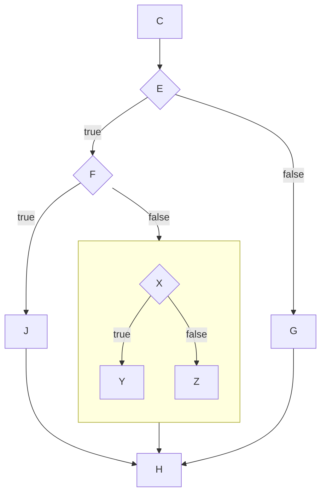
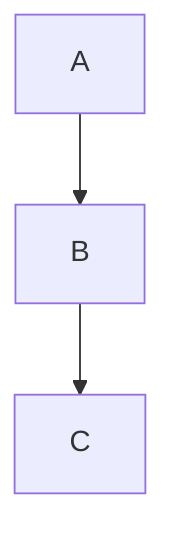
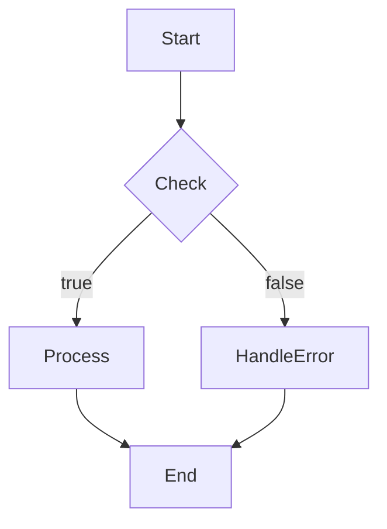

# YAML2DAG

Convert YAML configurations into DAG (Directed Acyclic Graph) visualization using Mermaid.

[中文文档](#中文文档)

## 📊 Example Output



▶️ [Edit this diagram in Mermaid Editor](https://devref.cc/tools/mermaid#data/eJxNjr0OgzAMhPc-xck7r9ChKASFtQNgdaD8FCQEKIA6QN-9SYgQ2-fz2XdNP37LttALno8bEDKF9DIgNhL0MxBtFDmQTNKtFJNyEDPFBuwZguAOYe8s7Yte6x3ROTdFPxtB2n8Xgzpnb0jss3l9f3QxtUiY4IKAqtN1uXTjcNQE0o1SVwvImDJvy5lyj-klJ7soPik3Uj1UNk-58rGh5CR50B_VekWE)

## ✨ Features

- 🔄 **Live Rendering** - Instantly generate DAG diagrams from YAML configuration
- 🌲 **Conditional Branching** - Support `true_node/false_node` conditional nodes with true/false branches
- 📦 **Subgraph Nesting** - Support `sub_dag` subgraph configuration
- 📝 **Multiple DAG Configs** - Use `---` to separate multiple DAG definitions
- 🎨 **Beautiful UI** - Modern dark theme design
- 📋 **Code Preview** - View generated Mermaid code

## 🚀 Quick Start

```bash
# Install dependencies
npm install

# Start development server
npm run dev
```

Visit http://localhost:3000 to get started.

## 📝 YAML Configuration Format

### Basic Configuration

```yaml
dag_id: "my_dag"
nodes:
  - node_id: "A"

  - node_id: "B"
    deps: ["A"]

  - node_id: "C"
    deps: ["B"]
```

Generates:



### Conditional Branching

Use `true_node` and `false_node` to define conditional branches:

```yaml
dag_id: "conditional_dag"
nodes:
  - node_id: "Start"

  - node_id: "Check"
    true_node: "Process"
    false_node: "HandleError"
    deps: ["Start"]

  - node_id: "Process"
    deps: ["Check"]

  - node_id: "HandleError"
    deps: ["Check"]

  - node_id: "End"
    deps: ["Process", "HandleError"]
```

Generates:



### Sub DAG Configuration

Use `---` to separate main DAG and sub DAG:

```yaml
dag_id: "main_dag"
nodes:
  - node_id: "K"
    sub_dag: "sub_dag"

---
dag_id: "sub_dag"
nodes:
  - node_id: "X"
    true_node: "Y"
    false_node: "Z"

  - node_id: "Y"
    deps: ["X"]

  - node_id: "Z"
    deps: ["X"]
```

## 🛠 Tech Stack

- **Next.js 14** - React Framework
- **TypeScript** - Type Safety
- **Tailwind CSS** - Styling
- **Mermaid.js** - DAG Rendering
- **yaml** - YAML Parsing

## 📄 License

MIT

---

# 中文文档

将 YAML 配置转换为 DAG（有向无环图）可视化，使用 Mermaid 渲染。

## 📊 示例输出


▶️ [在 Mermaid 编辑器中编辑此图](https://devref.cc/tools/mermaid#data/eJxNjr0OgzAMhPc-xck7r9ChKASFtQNgdaD8FCQEKIA6QN-9SYgQ2-fz2XdNP37LttALno8bEDKF9DIgNhL0MxBtFDmQTNKtFJNyEDPFBuwZguAOYe8s7Yte6x3ROTdFPxtB2n8Xgzpnb0jss3l9f3QxtUiY4IKAqtN1uXTjcNQE0o1SVwvImDJvy5lyj-klJ7soPik3Uj1UNk-58rGh5CR50B_VekWE)

## ✨ 功能特性

- 🔄 **实时渲染** - 输入 YAML 配置即时生成 DAG 图
- 🌲 **条件分支** - 支持 `true_node/false_node` 条件节点，展示 true/false 分支
- 📦 **子图嵌套** - 支持 `sub_dag` 子图配置
- 📝 **多 DAG 配置** - 使用 `---` 分隔多个 DAG 定义
- 🎨 **美观界面** - 现代化深色主题设计
- 📋 **代码预览** - 查看生成的 Mermaid 代码

## 🚀 快速开始

```bash
# 安装依赖
npm install

# 启动开发服务器
npm run dev
```

访问 http://localhost:3000 开始使用。

## 📝 YAML 配置格式

### 基础配置

```yaml
dag_id: "my_dag"
nodes:
  - node_id: "A"

  - node_id: "B"
    deps: ["A"]

  - node_id: "C"
    deps: ["B"]
```

生成：


### 条件分支

使用 `true_node` 和 `false_node` 定义条件分支：

```yaml
dag_id: "conditional_dag"
nodes:
  - node_id: "Start"

  - node_id: "Check"
    true_node: "Process"
    false_node: "HandleError"
    deps: ["Start"]

  - node_id: "Process"
    deps: ["Check"]

  - node_id: "HandleError"
    deps: ["Check"]

  - node_id: "End"
    deps: ["Process", "HandleError"]
```

生成：


### 子 DAG 配置

使用 `---` 分隔主 DAG 和子 DAG：

```yaml
dag_id: "main_dag"
nodes:
  - node_id: "K"
    sub_dag: "sub_dag"

---
dag_id: "sub_dag"
nodes:
  - node_id: "X"
    true_node: "Y"
    false_node: "Z"

  - node_id: "Y"
    deps: ["X"]

  - node_id: "Z"
    deps: ["X"]
```

## 🛠 技术栈

- **Next.js 14** - React 框架
- **TypeScript** - 类型安全
- **Tailwind CSS** - 样式设计
- **Mermaid.js** - DAG 图渲染
- **yaml** - YAML 解析

## 📄 许可证

MIT
